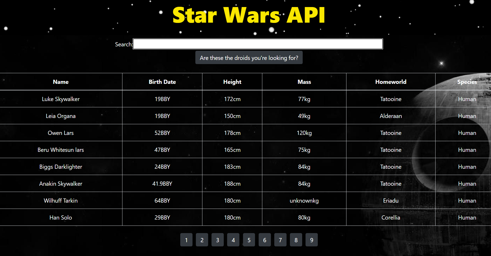

# Star Wars API 

A Simple table displaying character data from the Star Wars universe using React.js, Bootstrap 4, and Axios to make API calls to the SWAPI.dev API. 
Check it out [here](https://api-star-wars.herokuapp.com/)

# How to use

Simply search for any character in the Star Wars universe using the input box to get their information returned 

# Reference Image

# Summary

Building this application tought me a lot about how APIs work and how to manipulate the data to get certain data to populate onto my application. 
Among learning a lot about APIs, I continued to learn about React including axios and promises. This was a challenging but fun project that taught me 
a lot about React useability. 

# Author

Cesar Preza - Full Stack Developer [LinkedIn](https://www.linkedin.com/in/cesar-preza-72675278/)
